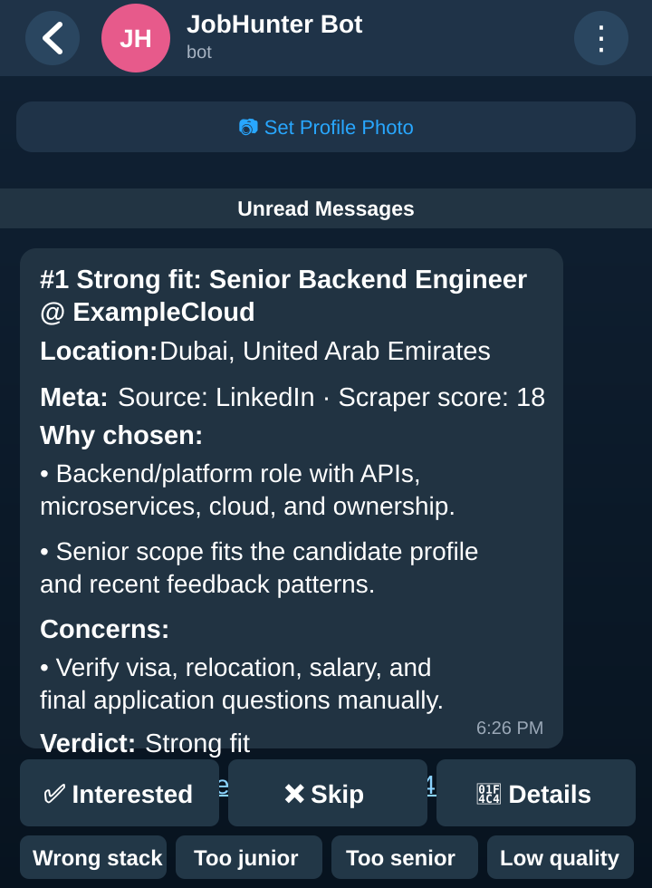
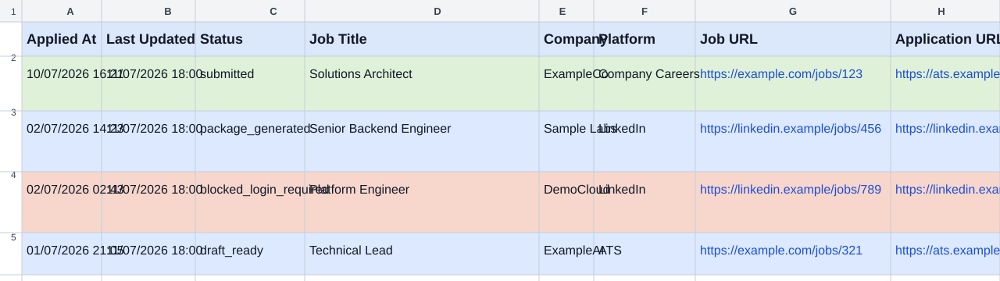
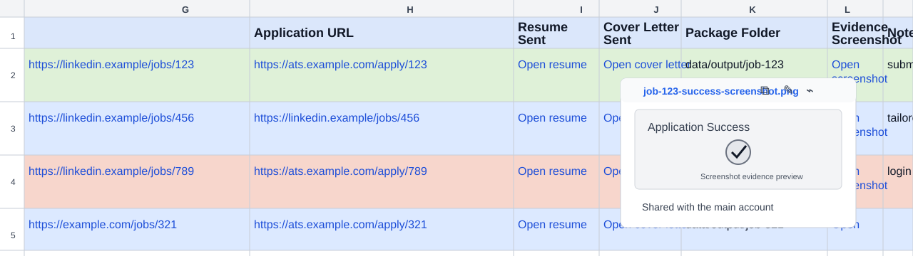

# JobHunter

JobHunter is an approval-gated job-search and application assistant designed to work well with [Hermes Agent](https://hermes-agent.nousresearch.com/).

It can:

- collect job opportunities from supported sources;
- store and deduplicate jobs in local SQLite;
- send at most the best 5 Telegram CTA job cards per day for review;
- learn from Interested/Skip feedback to demote repeatedly declined patterns and boost similar strong matches;
- run a brief Interested-stage company/recruiter/salary research check before generating an application package;
- run a resumable Resume Refiner interview that turns an uploaded resume and confirmed follow-up answers into a detailed evidence bank;
- generate truthful tailored resume / cover-letter packages from a local candidate profile;
- inspect LinkedIn / external ATS application pages through Chromium CDP;
- upload or submit only after explicit user approval;
- monitor a dedicated jobs Gmail mailbox for recruiter/ATS replies;
- sync an application tracker to a shared Google Sheet, including status, dates, resume/cover-letter links, and evidence screenshots;
- store generated ATS credentials in a local encrypted vault.

JobHunter is intentionally **not** a blind mass-apply bot. It stops on privacy notices, T&C, salary, visa/work authorization, CAPTCHA/security checks, and final submit unless the user explicitly approves.



## Quick start

```bash
git clone <your-fork-url> JobHunter
cd JobHunter
python3 -m venv .venv
. .venv/bin/activate
pip install -r requirements.txt
cp .env.example .env
cp data/master-profile.example.json data/master-profile.json
python -m pytest -q tests
```

Edit:

- `.env` — Telegram bot token/chat ID if you want Telegram cards/buttons.
- `data/master-profile.json` — your truthful candidate profile. This file is ignored by git.

Before enabling application-package generation, place your existing resume in an ignored path under `data/` and ask Hermes to run **Resume Refiner**. Hermes reviews the imported facts with you, interviews you experience by experience, and stores only facts and resume wording you explicitly confirm. The interview can be paused and resumed.

Resume Refiner can also store candidate-confirmed role-family variants, such as JVM-backend or software-architect versions. A variant is a complete public resume snapshot containing the exact approved headline, summary, skills, certifications, experience selection, education, ordering, section omissions, matching terms, optional title-scoped `role_terms`, and optional page limit. JobHunter combines it only with the current identity and contact fields; unspecified master-profile sections are not inherited. Draft or unconfirmed variants are ignored. Most jobs use evidence ranking when no variant matches, but architecture-titled jobs pause until a matching role-scoped variant is confirmed. Package generation also pauses for obvious inconsistent role chronology rather than guessing a date.

For the full setup guide, see [`setup.md`](setup.md).

## Hermes Agent setup

If you use Hermes Agent, clone the repo and start Hermes from the repo root:

```bash
cd JobHunter
hermes
```

Hermes will read [`AGENTS.md`](AGENTS.md) automatically as project instructions. You can then ask:

```text
Set up JobHunter for me using setup.md. Keep all credentials and personal data local, run the tests, and tell me what is missing.
```

For a new profile, use:

```text
Run Resume Refiner on the resume I placed under data/. Ask me one focused question at a time, keep every claim truthful, and update the local master profile only after I confirm each proposed fact.
```

Recommended Hermes toolsets for full operation:

- terminal
- file
- browser or local Chromium/CDP access
- web
- cronjob, if you want scheduled collection/review
- messaging, if using Telegram gateway integration

## Account model

JobHunter is designed around two Google identities:

| Account | Purpose |
|---|---|
| Main/personal Google account | The human owner account. It owns or can view the shared Google Sheet/Drive folder. |
| Dedicated jobs/agent Gmail account | The mailbox/API identity used by JobHunter for ATS verification emails, recruiter replies, approved outbound mail, and Google Sheets/Drive automation. |

Recommended pattern:

1. Create the tracker spreadsheet from the main/personal account.
2. Share it with the dedicated jobs Gmail account as **Editor**.
3. When JobHunter uploads resumes, cover letters, and screenshots to Drive through the jobs Gmail account, also grant the main/personal account access to the generated Drive folder/files so the human owner can open every link in the tracker.
4. Keep OAuth tokens and client secrets outside the repo.

## Core commands

Collect jobs:

```bash
python scraper.py --collect-only
```

Inspect a job:

```bash
python scraper.py --get-job <job_id>
```

Mark a job as interested:

```bash
python scraper.py --mark-interested <job_id>
```

Telegram CTA flow:

```text
Interested → brief research card → Apply / Ignore / Details
Apply      → validate chronology and role-variant gate → select confirmed variant or legacy tailoring → generate package + manifest → Proceed to apply / Pause
Blocked    → generate nothing and record no package stage → Refine resume / Pause
Proceed   → begin application prep only; final submit remains explicitly approval-gated
```

The research card is intentionally brief and warning-only. It does a best-effort web lookup for company/recruiter/salary context, then falls back to stored metadata if search fails. It summarizes company context, recruiter/poster info when stored, obvious legitimacy concerns, and a salary note compared with the configurable monthly AED target:

```env
JOBHUNTER_TARGET_SALARY_AED_MONTHLY=30000
JOBHUNTER_INTERESTED_WEB_RESEARCH=true
JOBHUNTER_WEB_RESEARCH_TIMEOUT=8
```

Inspect the currently open application page through Chromium CDP:

```bash
python -m jobhunter_auto_apply.cli inspect --job-id <job_id>
```

Upload only after explicit approval:

```bash
python -m jobhunter_auto_apply.cli upload \
  --job-id <job_id> \
  --selector 'input[type=file]' \
  --file data/output/<job_id>/resume.pdf \
  --approved
```

Submit only after explicit approval:

```bash
python -m jobhunter_auto_apply.cli submit \
  --job-id <job_id> \
  --selector 'button[type=submit]' \
  --approved
```

## Repository layout

| Path | Purpose |
|---|---|
| `scraper.py` | Job collection, scoring, DB utilities, Telegram helpers |
| `callback_handler.py` | Telegram button handler |
| `render_pdf.py` | Resume and cover-letter PDF renderer |
| `resume_refiner.py` | Refined-profile validation, confirmed-evidence handling, and safe atomic profile updates |
| `jobhunter_auto_apply/` | Approval-gated browser apply helpers |
| `jobhunter_integrations/google_tracker.py` | Open-source-safe Google Sheets/Drive tracker sync CLI |
| `jobhunter_integrations/gmail_watcher.py` | Open-source-safe Gmail watcher CLI for recruiter/ATS replies |
| `job-hunter.skill.md` | Hermes skill/runbook for this project |
| `setup.md` | Full setup guide |
| `data/master-profile.example.json` | Safe candidate-profile schema example |
| `tests/` | Test suite |

## Application tracker

JobHunter can maintain a Google Sheet tracker that mirrors local application state from SQLite. The Sheet is intended for humans; the database remains the automation source of truth.

Typical tracker fields include application date, status, company/title, platform, job/application URLs, linked resume, linked cover letter, linked evidence screenshot, notes, and next action.



The tracker can also link generated artifacts and evidence files so the main account can open application packages without accessing local runtime data directly.



Recommended permissions:

1. Main/personal Google account creates or owns the Sheet.
2. Dedicated jobs Gmail is granted **Editor** on the Sheet.
3. JobHunter OAuth for the jobs Gmail includes Gmail scopes plus `spreadsheets` and `drive.file`.
4. Files uploaded by the jobs Gmail, such as resumes, cover letters, and screenshots, must also be shared with the main/personal Google account so the owner can open links from the Sheet.

Recommended formatting includes wrapped text, taller rows, frozen headers, `dd/mm/yyyy hh:mm`-style dates, and status colors such as green for `submitted`, red for blockers/failures, blue for package/draft states, purple for `interested`, and grey for `skipped`.

Run a tracker sync:

```bash
python -m jobhunter_integrations.google_tracker \
  --spreadsheet-id "$JOBHUNTER_TRACKER_SPREADSHEET_ID" \
  --google-token "$GOOGLE_TOKEN_PATH"
```

Run the Gmail watcher once:

```bash
python -m jobhunter_integrations.gmail_watcher \
  --google-token "$GOOGLE_TOKEN_PATH"
```

Both commands are safe to schedule from cron/Hermes cron. They read secrets only from local ignored files/env variables. The Gmail watcher marks inspected messages as read so the dedicated jobs mailbox stays clean.

To keep the Sheet live while applying, enable best-effort auto-sync after every application stage update:

```env
JOBHUNTER_AUTO_SYNC_TRACKER=true
JOBHUNTER_TRACKER_SYNC_COMMAND=/absolute/path/to/jobhunter_sync_application_tracker.sh
JOBHUNTER_TRACKER_SYNC_TIMEOUT=120
```

Auto-sync failures are logged but do not block application progress; SQLite remains the source of truth.

## Safety model

JobHunter should never:

- fabricate resume facts;
- guess legal, visa, salary, or eligibility answers;
- bypass CAPTCHA or anti-bot checks;
- print or commit cookies/tokens/passwords;
- submit applications without explicit approval unless a narrow user-defined allowlist exists.

JobHunter should always:

- keep profile data, databases, generated documents, browser profiles, and credentials local;
- use only candidate-confirmed public evidence from Resume Refiner in generated application documents;
- record application state in SQLite;
- save evidence screenshots for blockers/draft-ready states when useful;
- ask the user with clear CTA options at approval gates.

For CAPTCHA or other human-verification blockers, pause automation and let the user complete the challenge in the live browser. A practical remote-handoff pattern for Raspberry Pi deployments is VNC from a phone: enable VNC/remote desktop on the Pi, connect with a mobile VNC app to `<pi-lan-or-vpn-ip>:5900`, complete the CAPTCHA manually, then tell the agent to continue. Use LAN/VPN access only; never expose VNC, cookies, browser profiles, or CDP ports to the public internet.

## Git hygiene

The repo ignores local runtime/private data, including:

```text
.env
.venv/
browser-profiles/
data/*
!data/master-profile.example.json
*.log
*.backup*
tmp_cdp_*.py
```

Before contributing, run:

```bash
python -m pytest -q tests
git status --short
```
